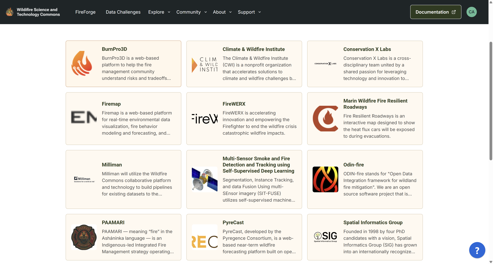

# Wildfire Commons Pathfinders

Pathfinders showcase and multiply the impact of existing efforts that leverage open data and open science for wild land fire solutions. 

To check on the current Pathfinders, [click here](https://www.wildfirecommons.org/pathfinders).

To list your research grant, organization initiative or project, please email us at `pathfinder@wildfirecommons.org` to share your idea or join an existing pathfinder.