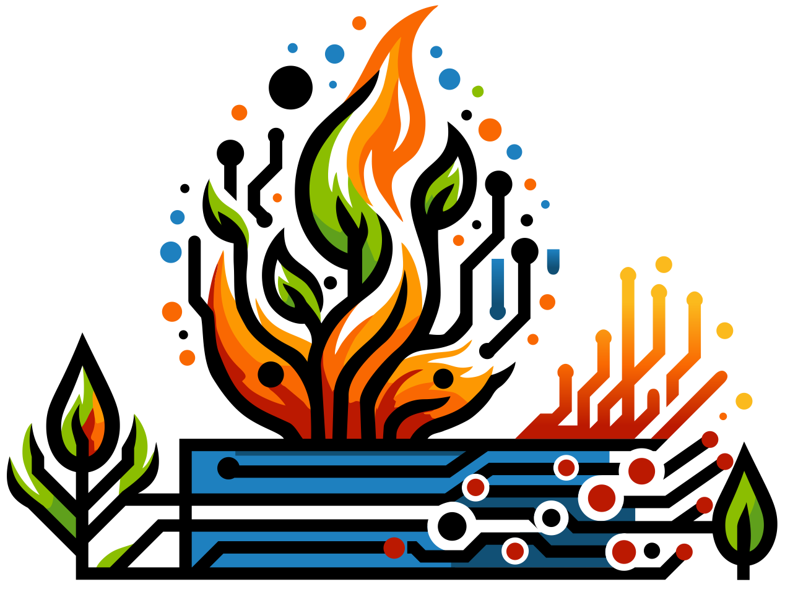

# Wildfire Commons Documentation

This is the official documentation site for the [Wildfire Commons](https://www.wildfirecommons.org/).

We believe that avoiding devastating wildfires requires urgent, innovative, and collaborative solutions. The Wildfire Science & Technology Commons is a bold new initiative designed to accelerate technological innovations for wildfire management and mitigation. We are building a community platform around open data, cutting-edge science, AI, and shared knowledge.
 
 
Our mission is to bring people together to break down the barriers that currently exist between wildfire-related data, models, and tools. Today these resources are siloed, which slows down innovation. We have the opportunity to create a seamless, smart platform to enable solutions that revolutionize how we understand, respond to, and prevent wildfires. Together, we can protect lives, property, and ecosystems from the ever-growing threat of wildfires.

Learn how to begin using the Wildfire Commons from Get Started: [Get Started](./start/getting-started.md)

Helpful Quick Links:

- [Get Started](./start/getting-started.md)

- [Create an Account - Expert Network Profile](./start/signin.md)

- [Catalog](./catalog/catalog.md)

- [Registering Catalog Products]()

- [FireForge](https://fireforge.wildfirecommons.org/)

!!! info
    The Wildfire Science & Technology Commons is a UC San Diego initiative funded by the National Institute of Standards and Technology (NIST). Special thanks to Senator Alex Padilla (D-CA) and Representatives Juan Vargas (CA-52) and Sara Jacobs (CA-51) for their support of this project through the Congressional appropriations process.

