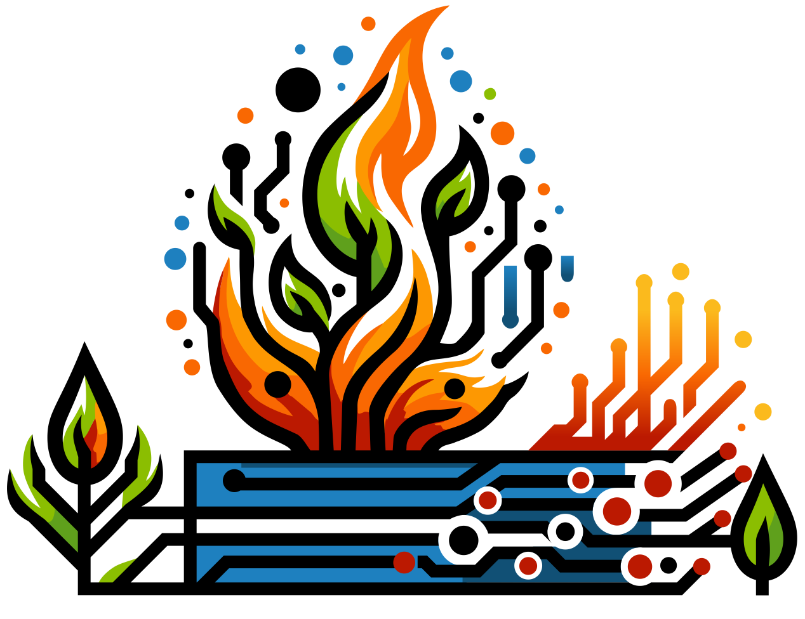

# Wildfire Commons Documentation

This is the official documentation site for the [Wildfire Science and Technology Commons](https://www.wildfirecommons.org/).

Avoiding devastating wildfires requires urgent, innovative, and collaborative solutions. The Wildfire Science & Technology Commons is a bold new initiative designed to accelerate technological innovations for wildfire management and mitigation. We are building a community platform around open data, cutting-edge science, AI, and shared knowledge.

## About

The [Wildfire Science & Technology Commons (Wildfire Commons)](https://www.wildfirecommons.org/) is a community platform for wildfire-related data, models, tools, and services. Community members can join the Expert Network and list their wildfire research projects, organizations, or initiatives as Pathfinders. Once you have joined the Expert Network and listed your initiative as a Pathfinder, you can begin using the [FireForge Platform](./getting-started/common-use-cases/general-users.md), an extension of the [National Data Platform](https://nationaldataplatform.org/documentation/) for the wildfire community.

Our mission is to bring people together to break down the barriers that currently exist between wildfire-related data, models, and tools. Today these resources are siloed, which slows down innovation. We have the opportunity to create a seamless, smart platform to enable solutions that revolutionize how we understand, respond to, and prevent wildfires.

The Wildfire Commons' aim is to:

- Accelerate innovation
- Foster open science
- Promote transparency
- Enable collaboration
- Prepare for scale
- Forge coalitions

## Driving tasks

Driving tasks for the Wildfire Commons to achieve these goals include:

- **Building an Expert Network:** Engage the wildfire science and technology community, as well as the community of application, to support thought leadership of the Wildfire Commons.
- **Wildfire Commons Framework:** Develop a functional framework for the integration and sharing of data, models, and tools to drive next-generation fire science and operational practice.
- **Case Studies for Vegetation & Fuel:** Demonstrate impact through interconnected case studies related to landscape and wildland fire fuels management technologies.
- **Pathfinder Projects for Future Directions:** Work with the community of practice to select pathfinder projects to scale data and models for future application.
- **Creation of Blueprint for Future Phases:** Planning achievable, scalable, and sustained use of the Wildfire Commons for collective impact.

## Helpful Quick Links:

- [Create an Account](./getting-started/registration.md)

- [Catalog](./getting-started/catalog/basics.md)

- [Working in FireForge](./getting-started/workspaces/basics.md)

!!! info
    The Wildfire Science & Technology Commons is a UC San Diego initiative funded by the National Institute of Standards and Technology (NIST). Special thanks to Senator Alex Padilla (D-CA) and Representatives Juan Vargas (CA-52) and Sara Jacobs (CA-51) for their support of this project through the Congressional appropriations process.

